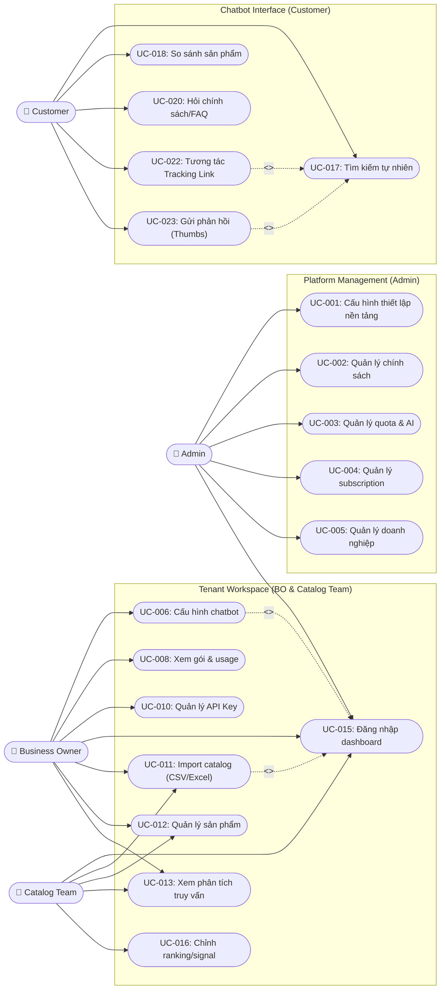

# Thông tin thiết kế Use Case Diagram - Smart Shopping Chatbot SaaS

Dựa trên luồng nghiệp vụ của hệ thống và danh sách 23 Use Cases bạn cung cấp, đây là toàn bộ thông tin đã được chuẩn hóa, phân nhóm và xác định các mối quan hệ (Relationships) để bạn có thể đưa vào bất kỳ công cụ vẽ UML nào (Enterprise Architect, StarUML, Draw.io, PlantUML,...).

---

## 1. Hệ thống (System Boundary)
- **Tên hệ thống:** Nền tảng Smart Shopping Chatbot SaaS
- **Phạm vi:** Bao gồm toàn bộ các tính năng từ quản trị nền tảng (Admin), quản trị doanh nghiệp (Business Owner, Catalog Team) đến giao diện trò chuyện cuối (Customer).

---

## 2. Các tác nhân (Actors)
Hệ thống có **4 Actors chính**:

1. **Admin (Quản trị viên hệ thống):** Người vận hành nền tảng SaaS, quản lý các doanh nghiệp thuê bao (tenants), gói cước (subscription) và tài nguyên AI.
2. **Business Owner (Chủ doanh nghiệp):** Người đăng ký sử dụng dịch vụ, có toàn quyền quản lý cửa hàng của mình (bao gồm cả các quyền của Catalog Team) và quản lý thanh toán, API Keys.
3. **Catalog Team (Nhân viên vận hành/Marketing):** Nhân sự của doanh nghiệp được phân quyền để quản lý dữ liệu sản phẩm, tài liệu RAG và xem thống kê (không có quyền xem thanh toán, API Keys hay đổi thông tin doanh nghiệp).
4. **Customer (Khách hàng cuối):** Người mua sắm tương tác với Chatbot trên website của doanh nghiệp.

*Lưu ý về kế thừa (Generalization):* Actor `Business Owner` có thể kế thừa (cùng trỏ chung) tất cả các Use Case của `Catalog Team`.

---

## 3. Phân rã Use Cases theo Phân hệ (Subsystems)

Để biểu đồ không bị rối (vì có tới 23 UCs), bạn nên gom nhóm (Group / Subsystem) thành 3 phân hệ lớn:

### Phân hệ 1: Quản trị Nền tảng SaaS (Dành cho Admin)
- **UC-001:** Cấu hình thiết lập nền tảng SaaS
- **UC-002:** Quản lý chính sách nền tảng
- **UC-003:** Quản lý quota và tài nguyên AI theo doanh nghiệp
- **UC-004:** Quản lý subscription plan
- **UC-005:** Quản lý doanh nghiệp trên nền tảng
- **UC-015:** Đăng nhập dashboard *(Dùng chung)*

### Phân hệ 2: Quản lý Cửa hàng & Tri thức (Business Owner & Catalog Team)
- **UC-006:** Cấu hình chatbot cho doanh nghiệp (Chỉ BO)
- **UC-007:** Import FAQ/policy document (Chỉ BO)
- **UC-008:** Xem subscription, quota và usage (Chỉ BO)
- **UC-009:** Quản lý thông tin doanh nghiệp/cửa hàng (Chỉ BO)
- **UC-010:** Quản lí API key của doanh nghiệp (Chỉ BO)
- **UC-011:** Import catalog bằng CSV/Excel (BO, Catalog Team)
- **UC-012:** Quản lý sản phẩm trong catalog (BO, Catalog Team)
- **UC-013:** Dashboard phân tích truy vấn (BO, Catalog Team)
- **UC-014:** Theo dõi hiệu suất truy xuất (BO, Catalog Team)
- **UC-016:** Điều chỉnh ranking/catalog signal (Chỉ Catalog Team)

### Phân hệ 3: Tương tác Chatbot (Dành cho Customer)
- **UC-017:** Tìm kiếm ngôn ngữ tự nhiên
- **UC-018:** So sánh được các sản phẩm với nhau
- **UC-019:** Lọc sản phẩm theo nhiều tiêu chí
- **UC-020:** Hỏi vể chính sách / FAQ
- **UC-021:** Nhận gợi ý theo ngữ cảnh hội thoại
- **UC-022:** Nhận và tương tác với Smart Tracking Link
- **UC-023:** Gửi phản hồi cho câu trả lời chatbot

---

## 4. Các mối quan hệ đặc biệt (Relationships)

Khi vẽ UML, bạn cần lưu ý các đường nét đứt biểu thị `<<include>>` và `<<extend>>`:

### Mối quan hệ `<<include>>` (Bắt buộc phải có)
- Tất cả các Use Case của Admin, Business Owner, và Catalog Team (Từ UC-001 đến UC-014, UC-016) đều phải trỏ đường `<<include>>` đến **UC-015 (Đăng nhập dashboard)**.
- Khi Customer tương tác với **UC-017, UC-018, UC-019**, hệ thống ẩn danh bắt buộc phải thực hiện query tìm kiếm, lúc này **UC-013/014 (Thống kê)** sẽ lưu log ngầm.

### Mối quan hệ `<<extend>>` (Tùy chọn, mở rộng tính năng)
- **UC-023 (Gửi phản hồi cho câu trả lời)** `<<extend>>` các Use Case hỏi đáp (**UC-017, UC-018, UC-020**). Điều kiện: Khách hàng chỉ có thể đánh giá Thumbs up/down sau khi chatbot đã trả lời.
- **UC-022 (Smart Tracking Link)** `<<extend>>` **UC-021 (Nhận gợi ý)** hoặc **UC-017 (Tìm kiếm)**. Khi chatbot show sản phẩm, nó đính kèm Tracking Link.

---

## 5. Tham khảo: Sơ đồ Mermaid (Flowchart mô phỏng Usecase)

Bạn có thể copy đoạn code dưới đây dán vào [Mermaid Live Editor](https://mermaid.live/) để ra ngay một bản phác thảo cấu trúc trực quan:

*Lời khuyên: Vì sơ đồ khá lớn, khi đưa vào báo cáo/đồ án, bạn nên chia làm 3 hình Use Case Diagram riêng biệt cho 3 phân hệ (Admin, Business, Chatbot) thay vì nhồi nhét tất cả vào 1 hình.*
